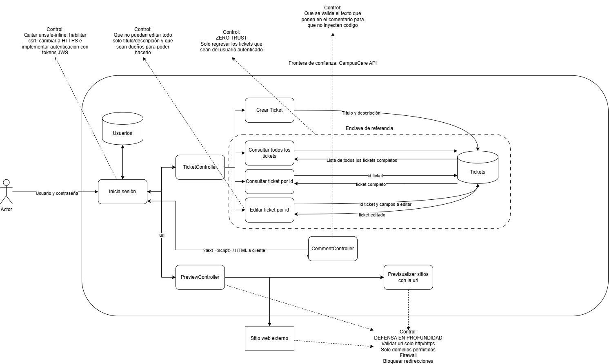

# Avance 1 - CampusCare

## 1. Identificación de Amenazas (STRIDE)

### 1.1 Elevation of Privilege / Information Disclosure

Un usuario puede obtener todos los tickets aprovechando que la consulta nunca solicita/valida que los tickets obtenidos son del usuario autenticado.

**Evidencia:** [`src/main/java/mx/edu/campuscare/tickets/TicketController.java`](../src/main/java/mx/edu/campuscare/tickets/TicketController.java)

```java
@GetMapping
public List<Ticket> all() {
    return repo.findAll();
}
```

- **Riesgo:** Exposición masiva de tickets ajenos por falta de validación (BOLA / Information Disclosure).
- **Método afectado:** `all()` ejecutando un `repo.findAll()` sin restricciones de propiedad.
- **Control propuesto:** Filtrar la consulta por el `userId` autenticado o restringir el acceso global solo al rol `ADMIN`.

---

### 1.2 Tampering

Un usuario puede editar todos los campos de un ticket aprovechando que el método `patch()` no valida qué campos del cuerpo de la petición están permitidos, permitiendo aplicar cualquier cambio deseado ya que no distingue entre campos editables y no editables.

**Evidencia:** [`src/main/java/mx/edu/campuscare/tickets/TicketController.java`](../src/main/java/mx/edu/campuscare/tickets/TicketController.java)

```java
@PatchMapping("/{id}")
public Ticket patch(@PathVariable Long id, @RequestBody Map<String, Object> body) {

    Ticket t = repo.findById(id).orElseThrow();
    if (body.containsKey("title"))
        t.setTitle(String.valueOf(body.get("title")));
    if (body.containsKey("status"))
        t.setStatus(String.valueOf(body.get("status")));
    if (body.containsKey("owner"))
        t.setOwner(String.valueOf(body.get("owner")));
    if (body.containsKey("privateNote"))
        t.setPrivateNote(Boolean.parseBoolean(String.valueOf(body.get("privateNote"))));
    return repo.save(t);
}
```

- **Riesgo:** Alteración no autorizada de campos sensibles (`owner`, `privateNote`) por binding excesivamente permisivo.
- **Método afectado:** `patch()` utilizando un `Map<String, Object>` sin restricciones de campos modificables.
- **Control propuesto:** Usar un objeto DTO específico o definir una lista blanca (allowlist) de propiedades editables.

---

### 1.3 Information Disclosure (SSRF)

Un usuario puede ingresar un link no autorizado en el preview de los links, aprovechando que no se validan los destinos, provocando que el servidor haga peticiones a redes internas o servicios restringidos y devuelva su respuesta.

**Evidencia:** [`src/main/java/mx/edu/campuscare/preview/PreviewController.java`](../src/main/java/mx/edu/campuscare/preview/PreviewController.java)

```java
@GetMapping
public String preview(@RequestParam String url) throws Exception {
    URI uri = URI.create(url);
    HttpRequest r = HttpRequest.newBuilder(uri).timeout(Duration.ofSeconds(3)).GET().build();
    return client.send(r, HttpResponse.BodyHandlers.ofString()).body();
}
```

- **Riesgo:** Falsificación de peticiones en el servidor (SSRF) o acceso a redes/IPs internas mediante URLs arbitrarias.
- **Método afectado:** `preview(@RequestParam String url)` ejecutando llamadas HTTP sin validar el destino.
- **Control propuesto:** Implementar una lista blanca estricta (allowlist) de dominios y bloquear el acceso a rangos de red privados.

---

## 2. Diagrama del Sistema



---

## 3. Justificación de Decisiones de Diseño

### 3.1 Verificar ownership del Ticket dentro de un Enclave de referencia (Zero Trust)

- **Solución elegida:** Todas las operaciones que modifican o consultan un ticket se agrupan bajo un mismo punto de verificación. Antes de realizar la operación deseada con el objeto, se compara la autenticación del usuario contra el owner del ticket (o su rol).
No basta con iniciar sesión, si no que cada acceso se reválida según el recurso al que se quiere acceder.
- **Alternativa:** Usar `@PreAuthorize()` de Spring Security.
- **Riesgo residual:** Como más que nada se comprobaría la autenticación del usuario con el owner del ticket, un usuario con el rol SUPPORT seguiría teniendo acceso a privateNote del ticket. El problema existe si un usuario con rol SUPPORT que no está asignado a trabajar con ese ticket lo podría ver en su totalidad.

### 3.2 Allowlist de destinos en Preview de URL

- **Solución elegida:** Se usa una Allowlist que permite el acceso explícitamente sólo a entidades aprobadas negando todo lo demás por defecto.
- **Alternativa:** Firewall a nivel de red.
- **Riesgo residual:** Si algún destino permitido es interno, el endpoint sigue siendo un punto de lectura para el atacante.

---

## 4. Pruebas por Amenaza

### 4.1 Elevation of Privilege / Information Disclosure — `all()` sin filtro por ownership

| Campo | Detalle |
| --- | --- |
| **Prueba** | Usuario A (ya autenticado) llama `GET /api/tickets` y se revisa el campo `owner` de cada ticket recibido. |
| **Resultado esperado** | Solo aparecen los tickets donde `owner` sea igual a Usuario A. |
| **A implementar** | Filtrar `findAll()` por el `userId` autenticado. |
| **Responsable** | Adel Fernando Méndez Lizo |

### 4.2 Tampering — `patch()` sin validación de campos permitidos

| Campo | Detalle |
| --- | --- |
| **Prueba** | Usuario A manda `PATCH /api/tickets/{id de ticket de Usuario B}` enviando `{"owner": "A", "privateNote": false}`. |
| **Resultado esperado** | La API niega el acceso, o si permite editar, los campos `owner` y `privateNote` del ticket del Usuario B no se modifican. |
| **A implementar** | Usar DTO sin `owner` ni `privateNote`. |
| **Responsable** | Norma Alicia Beltrán Martin |

### 4.3 Information Disclosure — SSRF en preview de URL

| Campo | Detalle |
| --- | --- |
| **Prueba** | Enviar peticiones con URLs no permitidas. |
| **Resultado esperado** | La petición es rechazada por la allowlist, en vez de devolver el contenido. |
| **A implementar** | Allowlist de dominios. |
| **Responsable** | Juan Pablo Olivarria Covarrubias / Rodrigo Tovar Vidal |
